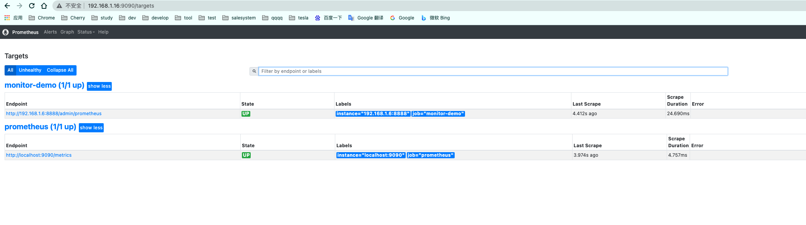
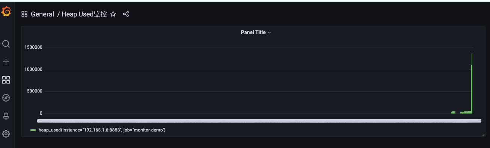

# monitor-prometheus-grafana

SpringBoot+Prometheus+Grafana 可视化监控

# Prometheus 官方文档：https://prometheus.io/docs/introduction/first_steps/

# Grafana 官方文档：https://grafana.com/docs/grafana/latest/


# prometheus
```text
https://prometheus.io/download/
```

创建docker挂载配置文件
```shell
cd /root/apps/prometheus/prometheus.yml
vim prometheus.yml
```
yaml配置
```yaml
global:
  scrape_interval: 15s
  scrape_timeout: 10s
  evaluation_interval: 1m
  external_labels:
    monitor: codelab-monitor
scrape_configs:
  - job_name: prometheus
    honor_timestamps: true
    scrape_interval: 5s
    scrape_timeout: 5s
    metrics_path: /metrics
    scheme: http
    static_configs:
      - targets:
          - localhost:9090
  - job_name: monitor-demo
    scrape_interval: 5s # 刮取的时间间隔 
    scrape_timeout: 5s
    metrics_path: /admin/prometheus
    scheme: http
    basic_auth: #认证信息
      username: admin
      password: 1234
    static_configs:
      - targets:
          - 192.168.1.6:8888 # springboot服务地址
```
启动
```shell
docker run --name prome1 -p 9090:9090 -v /root/apps/prometheus/prometheus.yml:/etc/prometheus/prometheus.yml prom/prometheus 
```
查看状态
```text
http://192.168.1.16:9090/targets
```


# Grafana
```text
https://grafana.com/grafana/download
```
启动
```shell
docker run -d --name grafana1 -p 3000:3000 grafana/grafana

admin/admin

http://192.168.1.16:3000/
```



